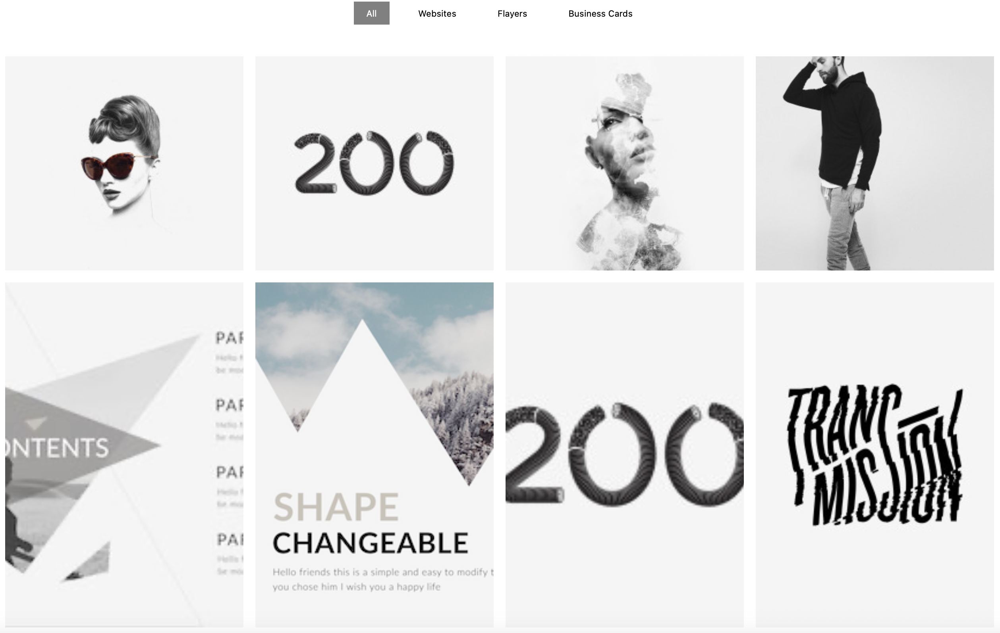
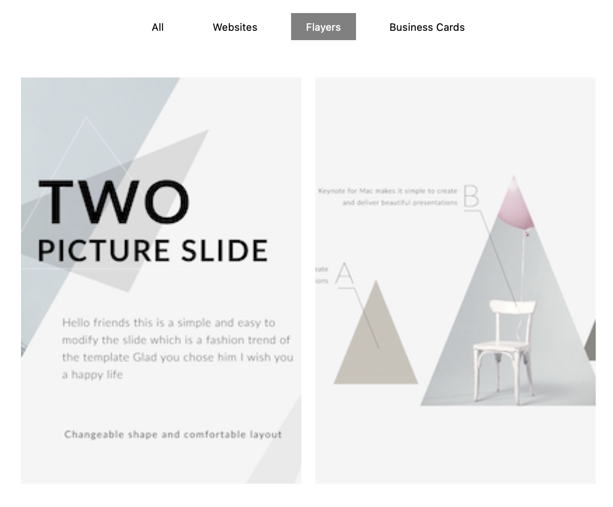
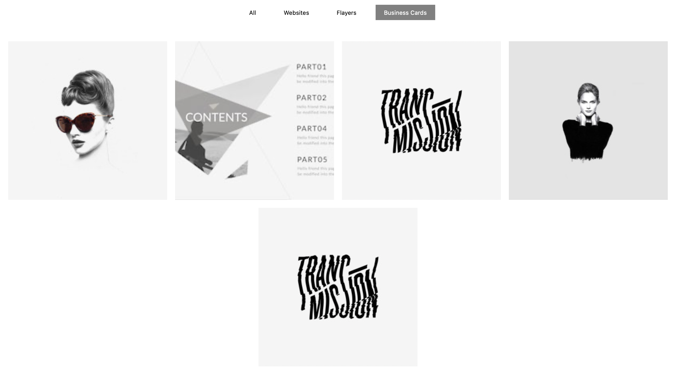

## Available Scripts

In the project directory, you can run:

### `npm start`
### `npm test`
### `npm run build`

##  About Project

An interactive project gallery with category-based filtering built using React.  
The project demonstrates component-based architecture, state management with `useState`, and dynamic data rendering.  
Supports category switching and responsive project card layout.

##  Screenshots

### 🔹 Main Gallery View

---

### 🔹 Flayers Filter

---

### 🔹 Business Cards Filter

